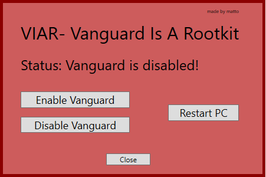

# VIAR
Vanguard Is A Rootkit

Simple app I wrote in 17 minutes to disable and enable vanguard at will. You choose enable or disable, then click restart. That's it. 

Download the initial release (https://github.com/matt1tk/VIAR/releases/tag/v1.0) and place it on your desktop or wherever. Then run it, choose disable and restart if you don't want to play Valorant. Choose enable and restart whenever you do want to play it. 

Want to know why Vanguard is a rootkit? https://www.youtube.com/watch?v=_dOCtaBObg4

This simply renames the vgk.sys so the system does not run the anti cheat at startup. If you want to play valorant, you must enable it and restart. Enjoy!

.png)
